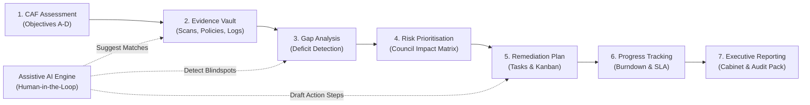

# Open CAF: Cyber Assessment Framework Self-Assessment & Remediation Platform

[](https://www.ncsc.gov.uk/collection/cyber-assessment-framework)
[](https://www.gov.uk/government/organisations/ministry-of-housing-communities-and-local-government)
[](file:///Users/rahul/open-caf-verification-pipeline/test/STEP_BY_STEP_PROMPTS.md)
[](LICENSE)

> **Open CAF** is an open-source, operational cyber resilience and remediation management platform built specifically for UK Local Authorities (borough, district, county, and unitary councils) and public sector bodies.

---

## 🏛️ Why Open CAF?

UK Councils manage vital frontline citizen services—Adult Social Care records, Electoral Registers, Housing Benefit disbursements, and local emergency planning. Under the **Government Cyber Security Strategy (GCSS 2022–2030)** and **MHCLG Cyber Assessment Framework for Local Government**, councils are mandated to assess their posture against **NCSC CAF v4.0**.

However, most councils struggle with:
* 📉 **The "Spreadsheet Nightmare":** Static NCSC Excel workbooks spanning 4 Objectives, 14 Principles, and 39 Contributing Outcomes with broken version control.
* 🗄️ **The Evidence Disconnect:** Pentest reports, Nessus/Defender scans, and DR drill logs remain isolated in SharePoint and email inboxes.
* 🔨 **No Remediation Bridge:** Assessments produce red/amber/green checkboxes without generating budgeted, assigned engineering tasks.
* 🏛️ **The Boardroom Gap:** Chief Executives, Section 151 (Finance) Officers, and Audit Committees need risk quantification tied to essential citizen services—not abstract compliance acronyms.

**Open CAF solves this** by shifting CAF from an annual audit chore into an **active operational resilience hub**.

---

## 🌟 The 7-Stage Core Capabilities



1. **CAF v4.0 Assessment Engine:** Full official taxonomy (4 Objectives, 14 Principles, 39 Contributing Outcomes, and all Indicators of Good Practice / IGPs).
2. **Tamper-Evident Evidence Vault:** Encrypted file storage supporting PDFs, DOCX, CSV/JSON vulnerability scans, and SharePoint links with SHA-256 integrity verification and automated annual freshness tracking (>12 months flagged as stale).
3. **Deficit & Evidential Gap Detection:** Automated calculation distinguishing between **Evidential Gaps** (claimed Achieved with no fresh evidence) and **Control Deficits** (unmet technical/procedural IGPs).
4. **Council Service Impact Matrix:** Local government risk scoring:
   $$\text{Priority Score (0-100)} = \text{Gap Severity} \times \text{Council Service Criticality (Tier 1/2/3)} \times \text{Threat Likelihood}$$
   * *Tier 1 (Critical):* Social Care, Council Tax / Benefits, Electoral Roll, Emergency Planning.
   * *Tier 2 (Operational):* Planning, Waste Management, Housing Repairs, Staff Intranet.
   * *Tier 3 (Informational):* Public brochures, Leisure bookings, Guest Wi-Fi.
5. **Remediation Action Planner & Kanban:** Auto-converts gaps into engineering tickets with owners, target dates, effort hours, and estimated cost (£ GBP).
6. **One-Click External Integrations:** Export tickets directly to **Jira REST API**, **GitHub Issues**, and formatted **Excel / CSV** registers for Internal Audit Committees.
7. **Assistive AI (Human-in-the-Loop):** Semantic evidence-to-IGP mapping, gap policy critiques, and remediation playbook drafting with client-side PII/IP scrubbing and switchable offline (Ollama) / private cloud LLM providers.
8. **1-Click Executive PDF Generator:** 2-page concise brief for Chief Executives & Section 151 Officers alongside 10-page Detailed Assurance Packs for external certifiers.

---

## 🏗️ Architecture & Monorepo Layout

```
open-caf/
├── docker-compose.yml              # Turnkey multi-container stack (Postgres + MinIO + API + UI)
├── docker-compose.override.yml     # Local hot-reloading development overrides
├── .env.example                    # Template environment variables
├── Makefile                        # Dev shortcuts (make dev, make test, make seed, make demo)
├── README.md                       # This file
├── STEP_BY_STEP_PROMPTS.md         # The 20-step implementation prompt playbook
│
├── backend/                        # FastAPI (Python 3.11+)
│   ├── alembic/                    # Database migrations
│   ├── app/
│   │   ├── main.py                 # Application entrypoint & middlewares
│   │   ├── core/                   # Config, security (JWT/RBAC), database, logging
│   │   ├── models/                 # SQLAlchemy 2.0 models (CAF, Evidence, Tasks, Users)
│   │   ├── schemas/                # Pydantic v2 validation models
│   │   ├── api/v1/                 # Versioned REST routers (auth, caf, evidence, gaps, etc.)
│   │   ├── services/               # Core business logic & scoring algorithms
│   │   ├── ai/                     # AI Copilot: Redactor, Embeddings, LLM Orchestrator
│   │   ├── reports/                # WeasyPrint PDF report templates (Executive & Audit)
│   │   └── cli/                    # Seed runners (CAF v4.0 seed & realistic demo loader)
│   └── tests/                      # Pytest unit & integration test suites
│
├── frontend/                       # Next.js 15 (App Router) + React 19 + Tailwind CSS
│   └── src/
│       ├── app/                    # Pages: dashboard, assessments, evidence, gaps, remediation
│       ├── components/             # Reusable UI components & accessible GOV.UK-inspired theme
│       ├── hooks/                  # React queries, auth context, assessment state
│       ├── lib/                    # Axios/fetch API client & utilities
│       └── types/                  # TypeScript interfaces matching backend models
│
└── data/
    ├── caf_v4_seed.json            # Authoritative NCSC CAF v4.0 taxonomy & IGPs
    ├── council_services.json       # Standard UK council service catalog & tier mappings
    └── demo_council_data.json      # "Borsetshire District Council" realistic demo dataset
```

---

## ⚡ Turnkey Quick Start (Run in 2 Minutes)

```bash
# 1. Clone the repository
git clone https://github.com/your-council-or-org/open-caf.git
cd open-caf

# 2. Copy the environment configuration
cp .env.example .env

# 3. Spin up all containers (Database with pgvector, Storage, Backend, Frontend)
docker compose up -d

# 4. Seed official NCSC CAF v4.0 framework data
docker compose exec backend python -m app.cli.seed_caf

# 5. (Optional) Load "Borsetshire District Council" realistic demo assessment
docker compose exec backend python -m app.cli.load_demo
```

Access the applications:
* **Frontend Web Application:** [http://localhost:3000](http://localhost:3000)
* **Interactive API Documentation (Swagger):** [http://localhost:8000/docs](http://localhost:8000/docs)
* **Default Admin Login:** `ciso@borsetshire.gov.uk` / `CouncilResilience2026!`

---

## 📋 Step-by-Step Implementation Roadmap

Open CAF is designed to be built progressively across **20 structured, industry-grade steps**. 

For the complete, copy-paste prompt guide with exact code instructions and verification commands for each step, see:

👉 **[STEP_BY_STEP_PROMPTS.md](file:///Users/rahul/open-caf-verification-pipeline/test/STEP_BY_STEP_PROMPTS.md)**

| Phase | Steps | Focus Area |
| :--- | :--- | :--- |
| **Phase 1** | Steps 1–4 | Monorepo scaffolding, PostgreSQL with `pgvector`, NCSC CAF v4.0 seed data, JWT RBAC auth. |
| **Phase 2** | Steps 5–7 | Assessment engine, scoring calculations, accessible Next.js UI shell, interactive assessment matrix. |
| **Phase 3** | Steps 8–10 | Secure evidence vault, SHA-256 tamper hashing, multi-tagging to outcomes, freshness tracking. |
| **Phase 4** | Steps 11–14 | Evidential gap vs control deficit detection, council service catalog (Tiers 1–3), risk scoring UI. |
| **Phase 5** | Steps 15–17 | Remediation task engine, Kanban board, budget burndown, Jira REST & GitHub & Excel exporters. |
| **Phase 6** | Steps 18–19 | PII/IP redaction pipeline, vector indexing, assistive AI Copilot (Human-in-the-loop). |
| **Phase 7** | Step 20 | Executive Cabinet Briefing PDF generator (WeasyPrint), realistic demo dataset, and launch hardening. |

---

## 🔒 UK Public Sector Security & Privacy Guardrails

1. **Air-Gapped / Offline LLM Support:** Fully functional with local **Ollama** (`llama3.3`, `mistral-nemo`) running inside council networks with zero external data transmission.
2. **Client-Side Data Redactor:** Automatically detects and scrubs internal IPv4/IPv6 addresses, internal hostnames (`*.gov.uk`), staff email addresses, and National Insurance numbers prior to embedding or LLM inference.
3. **Role-Based Access Control (RBAC):**
   * `CISO_ADMIN`: Full assessment configuration, tenant administration, and sign-off.
   * `SECURITY_ASSESSOR`: Editing assessment outcomes, uploading evidence, managing remediation tasks.
   * `AUDITOR`: Read-only view of assessment rationale, tamper checksums, and audit logs.
   * `CABINET_VIEWER`: High-level executive dashboard and briefing PDF generator.

---

## 📄 License & Attribution

Open CAF is released under the **Apache 2.0 License**. 
Contains public sector information licensed under the **Open Government Licence v3.0** (NCSC Cyber Assessment Framework v4.0).
